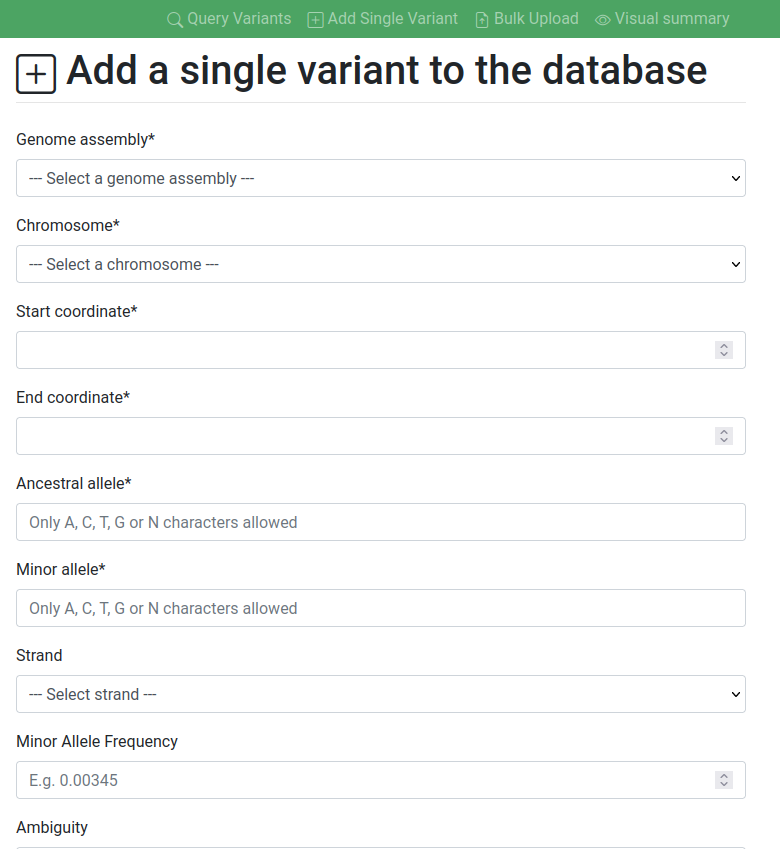

#  IT for Advanced Bioinformatics Applications: Variant Database
[![made-with-python][python-image]][python-url] [![django-image]][django-url] [![mongodb-image]][mongodb-url]

A variant database created with Django and MongoDB as part of BIOL60860.

## Team
* George Doyle ([@gdoy1](https://github.com/gdoy1/))
* Robert Wilson ([@RSWilson1](https://github.com/RSWilson1/))
* Ben Bunce ([@bbunce](https://github.com/bbunce))
* Becky Locke ([@rklocke](https://github.com/rklocke/))

## Set up
Install the requirements using requirements.txt:
```
pip install -r requirements.txt
```

Pull the official MongoDB Docker image from [DockerHub](https://hub.docker.com/_/mongo):
```
docker pull mongo
```
Run the container:
```
docker run -p 27017:27017 -d mongo --name variant_db
```
Copy the JSON containing variants into the container:
```
docker cp <path_to_file>/all_variants.json variant_db:/all_variants.json
```
Run interactively:
```
docker exec -it variant_db bash
```
Import the JSON into `my_database` into the collection `variants`:
```
mongoimport --db mydatabase --collection variants --file /all_variants.json
```

## Features
### Query the variants in the database
To query the variants that are present in the database, use the form present on the *Query Variants* page.

### Add variants to the database

#### Add a single variant
A single variant can be added via a form using the *'Add Single Variant'* page from the navigation bar. The form will validate your entries and check if your variant already exists in the database by genome assembly, chromosome, start, end, ancestral and minor alleles provided. If the variant already exists, the form will produce an error, otherwise your variant will be uploaded and a success message will be displayed.

#### Bulk upload variants
Variants can be uploaded in bulk via a JSON file using the *Bulk Upload* page. This form will also check if any variants in the JSON are present in the database and produce errors if they do while uploading any which do not already exist.


[python-image]: https://img.shields.io/badge/Made%20with-Python-green.svg
[python-url]: https://www.python.org/
[django-image]: https://img.shields.io/badge/Made%20with-Django-red.svg
[django-url]: https://www.djangoproject.com/
[mongodb-image]: https://img.shields.io/badge/Made%20with-MongoDB-blue.svg
[mongodb-url]: https://www.mongodb.com/