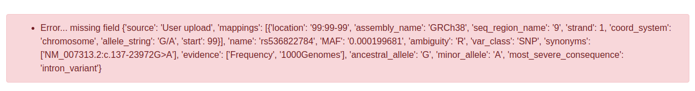

#  IT for Advanced Bioinformatics Applications: Variant Database
[![made-with-python][python-image]][python-url] [![django-image]][django-url] [![mongodb-image]][mongodb-url]

A variant database created with Django and MongoDB as part of BIOL60860.

## Team
* George Doyle ([@gdoy1](https://github.com/gdoy1/))
* Robert Wilson ([@RSWilson1](https://github.com/RSWilson1/))
* Ben Bunce ([@bbunce](https://github.com/bbunce))
* Becky Locke ([@rklocke](https://github.com/rklocke/))

## Set up
Clone the repo and install the requirements using requirements.txt:
```
cd uom_mongodb
pip install -r requirements.txt
```
Pull the official MongoDB Docker image from [DockerHub](https://hub.docker.com/_/mongo):
```
docker pull mongo
```
Run the container and copy the JSON containing variants into the container:
```
docker run -p 27017:27017 -d mongo --name variant_db
docker cp <path_to_file>/all_variants.json variant_db:/all_variants.json
```
Set env variable for the IP address of the Docker container:
```
nano ~/.bashrc
export UOM_DOCKER_IP="mongodb://<your_ip_address>:27017"
```
Run interactively:
```
docker exec -it variant_db bash
```
Import the JSON into `my_database` into the collection `variants`:
```
mongoimport --db mydatabase --collection variants --file /all_variants.json
```
Exit and finally, run the server:
```
python manage.py runserver
```

## Features
### Query the variants in the database
To query the variants that are present in the database, use the form present on the *Query Variants* page.
#### Example of querying with SNP, variant consequence and coordinate range, variant counter shows a subset of the whole database.


#### View summary of variant consequence from query
The summary of variant consequences from the query can be view by clicking on the `Query Summary Graph` button.


Example of query results summary graph of variant consequences. \


### Add variants to the database

#### Add a single variant
A single variant can be added via a form using the *'Add Single Variant'* page from the navigation bar.
* The form will validate your entries and check if your variant already exists in the database by the genome assembly, chromosome, start, end, ancestral and minor alleles provided.
* If the variant already exists, the form will produce an error, otherwise your variant will be uploaded and a success message will be displayed.


#### Bulk upload variants
Variants can be uploaded in bulk via a JSON file using the *Upload* page.


A success message will confirm everything has been uploaded correctly. \


This form will check if any variants in the JSON are already present in the database, have any missing mandatory field or do not conform to the correct format.




[python-image]: https://img.shields.io/badge/Made%20with-Python-green.svg
[python-url]: https://www.python.org/
[django-image]: https://img.shields.io/badge/Made%20with-Django-red.svg
[django-url]: https://www.djangoproject.com/
[mongodb-image]: https://img.shields.io/badge/Made%20with-MongoDB-blue.svg
[mongodb-url]: https://www.mongodb.com/
